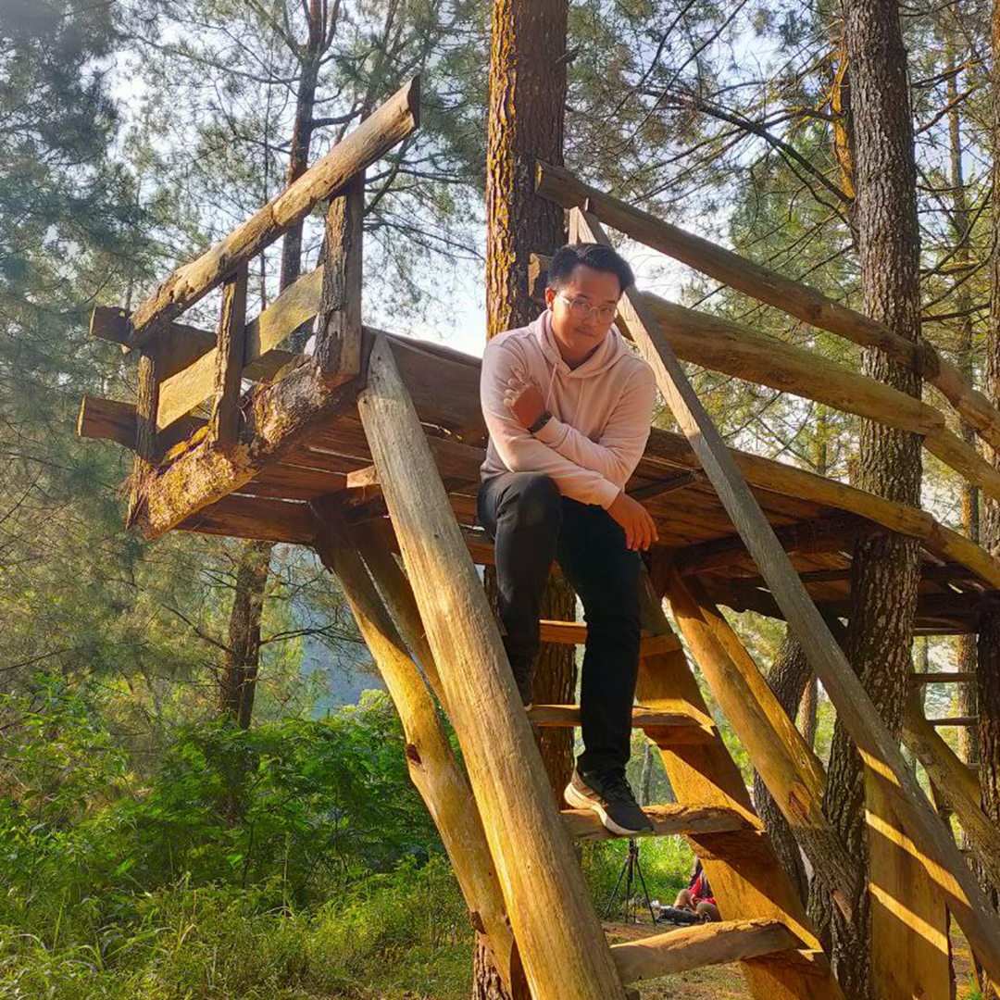
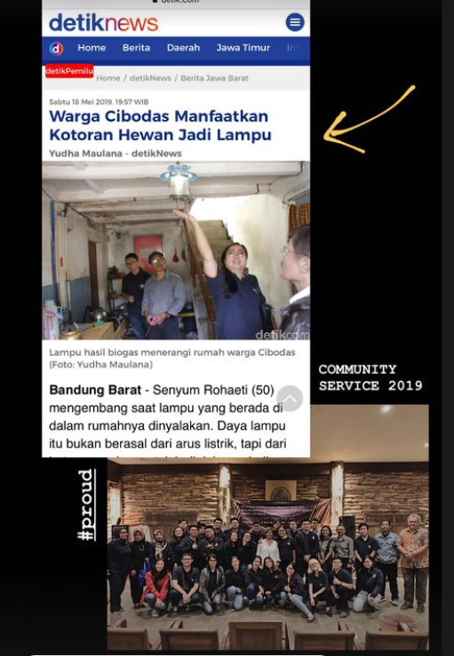
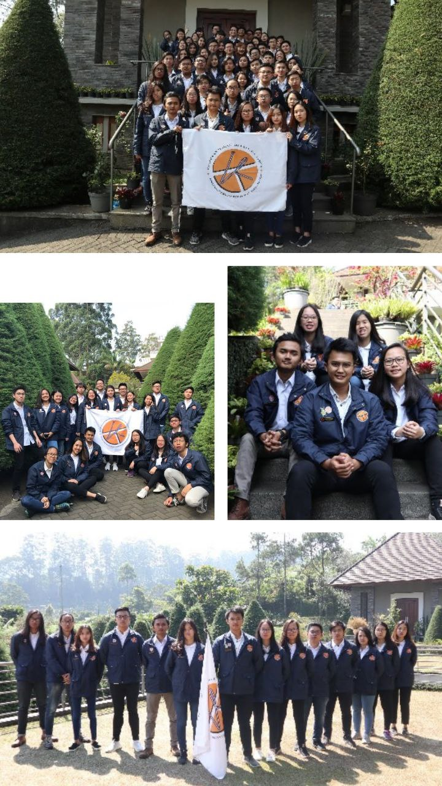
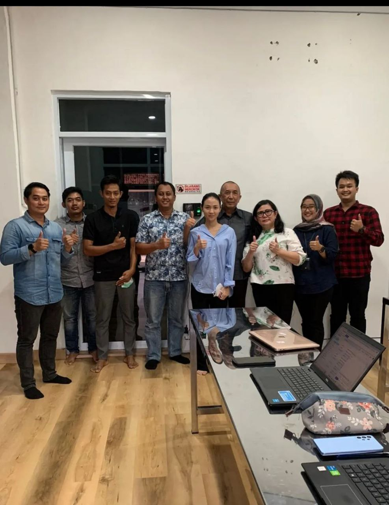
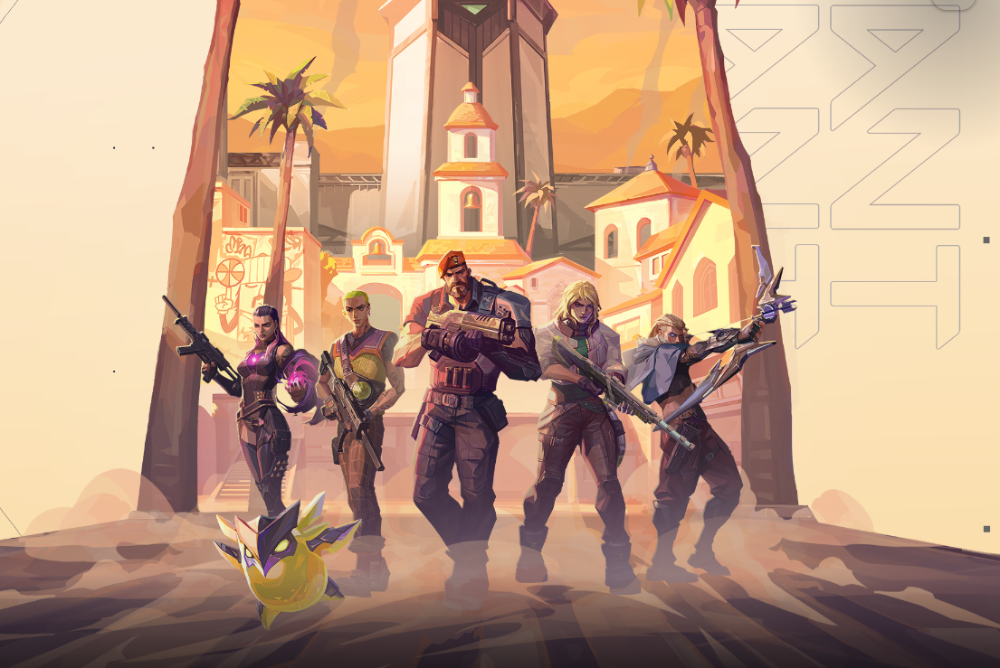
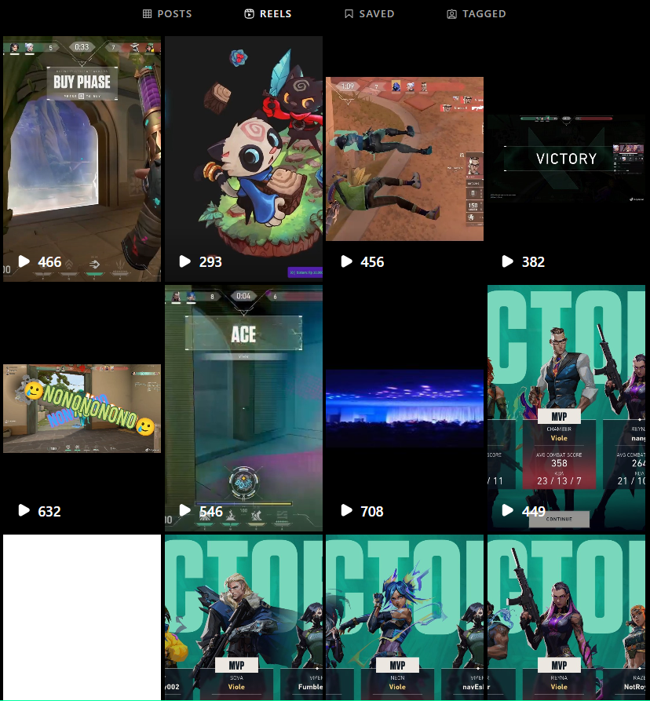

# S.A.M Profile :low_brightness:

> Halo Coding People !
> My First Project with RevoU: https://chipper-figolla-8059a4.netlify.app/

## My Bio :clipboard:

> SAM for Samuel Alvian Mahardika

I'm 24 Year old and have one  brother. Live in Bandung and currently work for myself with my family making snacks and foods for catering, cake store, and traditional cake markets for now.

I was Chemical Engineering Student college at Parahyangan Chatolic University (2017 - 2021). But I was not Finished my Study when Corona happened. 

**NOW..** I'm Here to make a new study, new job, and new journey in Software engineering. With zero knowledge but I have a purpose to move foward. So Let's have fun Together and **_よろしく お願いします_**.

## My Active Accounts :pushpin:
|Ative Accounts |                                Link                    |
|-------------|---------------------|
| :camera: Instagram   |[samuelalvian_](https://www.instagram.com/samuelalvian_/)|
| :iphone: Whatsapp    |[Urgent & Important Only](https://wa.me/qr/NRRW4PX4RF7QP1)|
| :link: Linkedin    |[Samuel Alvian](https://www.linkedin.com/in/samuel-alvian-m/)|
| :email: Email        |oensam07@gmail.com                                       |

## My Little Experience :stars:
#### 1. Leader of Community Service for Green Chemical Project
We Made a Biogas system with cow's feces, waste, and microorganism to be converted into Lights, and heat at Cibodas Bandung. 
- [More Info](https://tk.unpar.ac.id/kegiatan-pengabdian-masyarakat-teknik-kimia-unpar-the-lodge-foundation-di-cibodas/)

#### 2. President of Chemical Engineering Student Committee 2019 - 2020
I was "worked" with 45 staff, 2 vice precidents, and 11 Head of Division. Brought Chemical Students and Unparians to a Joyfull and Cheerfull life while struggling on their study. We made a lot of Activities called "Program Kerja", learned how to:
- Manage money which given from University;
- Make more money for our projects, Plans, Needs, and Partnerships;
- Manage People, Public, Staff and Fams;
- Make a new Network with other Institutions, organizations, and Company class Organization;
- To Complete our Vision.

#### 3. Quality Assurance - 2022 - 2023 
Last September 2022 My BOSS had a vision of me that I'am Cappable to take responsibility of leading the Quality Assurance system in his company at Cirebon, Jamblang. It was a brand new Swallow's edible nest Cleaning Company. Boss wanted me to built system of food hygene and HACCP (_Hazard Analysis and Critical Control Points_). I was helped by the QA Association Consultant and learned more about HACCP and ISO 22000 (although I learn it to when I was in university). The company called "Mutu Agung" as the jury and judge for successing the Quality Assurance system for Boss's Ataya Nata Walet (name of the Company). We get the Certificate of success and more certificates from goverments. 

## My _Happy Pills_ :pill:
| Valorant | Video Editing (sometimes) | Musics | Morning Ride | Cafe |
|----------|---------------------------|--------|--------|------|
| || :musical_note: :notes: [Youtube Music](https://music.youtube.com/playlist?list=LM)| ||

