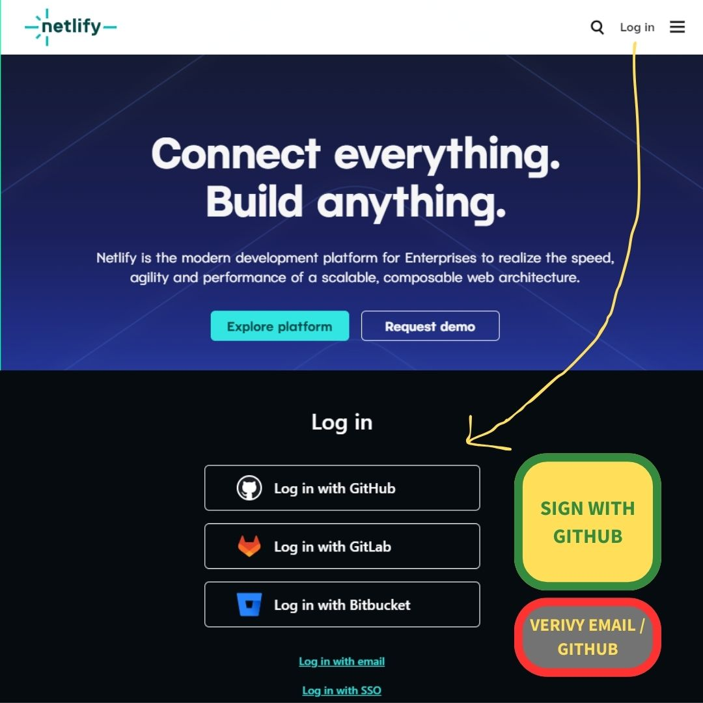

# S.A.M Profile :low_brightness:

> Halo Coding People !
> My First Project with RevoU: https://chipper-figolla-8059a4.netlify.app/

## My Bio :clipboard:
{width=500px height=500px}
> SAM for Samuel Alvian Mahardika

**NOW..** I'm Here to make a new study, new job, and new journey in Software engineering. With zero knowledge but I have a purpose to move foward. So Let's have fun Together and **_よろしく お願いします_**.

## My Active Accounts :pushpin:
|Ative Accounts |                                Link                    |
|-------------|---------------------|
| :camera: Instagram   |[samuelalvian_](https://www.instagram.com/samuelalvian_/)|
| :iphone: Whatsapp    |[Urgent & Important Only](https://wa.me/qr/NRRW4PX4RF7QP1)|
| :link: Linkedin    |[Samuel Alvian](https://www.linkedin.com/in/samuel-alvian-m/)|
| :email: Email        |oensam07@gmail.com                                       |

## Sam's Journal
I try to put some things I've learned about Software Engineering.

### Netlify Sign up and Synchronize with GitHub

#### Step 1: Sign Up for Netlify
1. Make sure you have a Github Account.
2. Go to the Netlify website: [https://www.netlify.com/](https://www.netlify.com/).
3. Click the "Sign Up" button and follow the registration process. Or sign with GitHub
4. Verify your email address to activate your Netlify account.
5. if you sign with github, you need to authenticate your account.

{width=800px height=800px}

#### Step 2: Connect Netlify to GitHub
1. Log in to your Netlify account.
2. Click "New site from Git" on the Netlify dashboard.
3. Choose your Git provider, which is GitHub in this case.
4. Authorize Netlify to access your GitHub repositories.
5. Select the GitHub repository you want to deploy.

{width=800px height=800px}

### The _Auto_ Deploy on Netlify from GitHub

#### Step 1: Configure Build Settings
1. After selecting your repository, you'll be prompted to configure build settings.
2. Choose your build settings, including the branch you want to deploy from.
3. Click "Deploy site" to initiate the first deployment.

{width=800px height=800px}


#### Step 2: Automatic Updates from GitHub
1. Netlify will automatically build and deploy your site when you push updates to the specified branch on GitHub.
2. Any changes made in the selected branch will trigger an automatic update on Netlify.

{width=800px height=800px}

### Make DNS to Custom Domain

#### Step 1: Buy a Domain from Your Domain Provider (e.g., Niagahoster)
1. Purchase a domain from your preferred domain provider, such as Niagahoster.
2. Note down the DNS settings provided by your domain provider.

{width=800px height=800px}

#### Step 2: Configure Custom Domain on Netlify
1. In your Netlify dashboard, select your site.
2. Under "Settings," go to the "Domain management" section.
3. Click "Add custom domain" and enter your purchased domain name.
4. Follow the instructions to verify and set up DNS records for your domain.
5. Netlify will configure your site to use the custom domain.

.jpg){width=800px height=800px}

### Manage Domain on Netlify

#### Step 1: Go to "site" and choose Domain Management
1. In your netlify Dashboard, select Site.
2. Choose Domain Management to set up your custom domain.
3. Click "add a domain" and enter your domain name.
4. Your Domain name must be match with the custom name you've made on your domain provider.

{width=800px height=800px}

#### Step 2: Check your Production Domains
1. After your custom domain registered on domain management, you must wait the synchronization and configuration between your Netlify DNS and domain provider site. 
2. It will take hours (max 24h) for the "awautubg External DNS turned into "Netlify DNS".
3. If it does, your custom domain or your website is online now.

{width=800px height=800px}

### How to Use Git for Version Control

#### Basic Git Commands

```shell
### Initialize a Git Repository
git init

### Clone a Repository
git clone <repository_url>

### Add Files to Staging Area
git add <file_name>  or
git add . 

### Commit Changes
git commit -m "Your commit message"

### Push Changes to Remote Repository
git push

### Pull Latest Changes from Remote Repository
git pull
```

## My Little Experience :stars:
#### 1. Leader of Community Service for Green Chemical Project
We Made a Biogas system with cow's feces, waste, and microorganism to be converted into Lights, and heat at Cibodas Bandung. 
- [More Info](https://tk.unpar.ac.id/kegiatan-pengabdian-masyarakat-teknik-kimia-unpar-the-lodge-foundation-di-cibodas/)


#### 2. President of Chemical Engineering Student Committee 2019 - 2020
I was "worked" with 45 staff, 2 vice precidents, and 11 Head of Division. Brought Chemical Students and Unparians to a Joyfull and Cheerfull life while struggling on their study. We made a lot of Activities called "Program Kerja", learned how to:
- Manage money which given from University;
- Make more money for our projects, Plans, Needs, and Partnerships;
- Manage People, Public, Staff and Fams;
- Make a new Network with other Institutions, organizations, and Company class Organization;
- To Complete our Vision.


#### 3. Quality Assurance - 2022 - 2023 
Last September 2022 My BOSS had a vision of me that I'am Cappable to take responsibility of leading the Quality Assurance system in his company at Cirebon, Jamblang. It was a brand new Swallow's edible nest Cleaning Company. Boss wanted me to built system of food hygene and HACCP (_Hazard Analysis and Critical Control Points_). I was helped by the QA Association Consultant and learned more about HACCP and ISO 22000 (although I learn it to when I was in university). The company called "Mutu Agung" as the jury and judge for successing the Quality Assurance system for Boss's Ataya Nata Walet (name of the Company). We get the Certificate of success and more certificates from goverments. 


## My _Happy Pills_ :pill:
| Valorant | Video Editing (sometimes) | Musics | Morning Ride | Cafe |
|----------|---------------------------|--------|--------|------|
| |[](https://www.instagram.com/reel/CxQH1vRuROn/)| :musical_note: :notes: [Youtube Music](https://music.youtube.com/playlist?list=LM)| ||


